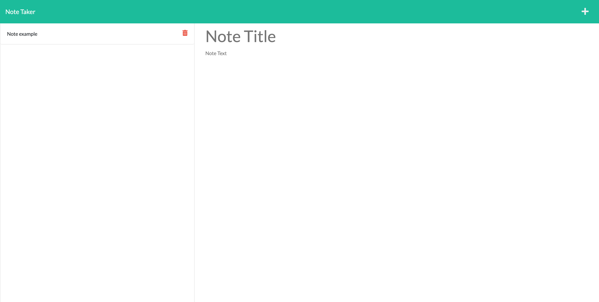
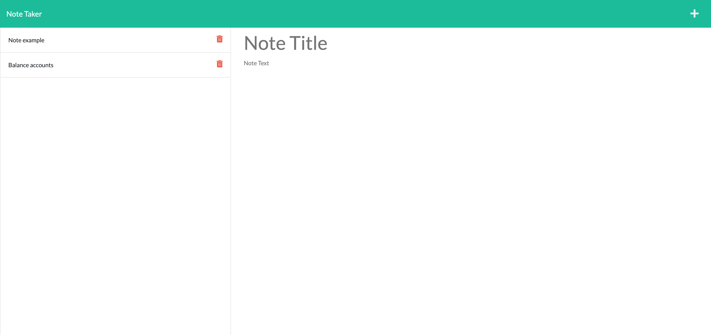

# Note Taker
## Description
The app allows for the owner to put in a note to follow up with at a later time. And then delete the note once it has been completed. 
## Table of Contents
- [Description](#description)
- [Installation](#installation)
- [Usage](#usage)
- [License](#license)
- [Contributors](#contributors)
- [Tests](#tests)
- [Questions](#questions)
- [Contact](#contact)

## Installation

There are no special requirements for the app other than the URL [weblink](https://young-brushlands-40959.herokuapp.com/) .

## Usage

Here is a quick video to start with [demonstration](https://drive.google.com/file/d/1_M6YuAuoHi6rncT1FvUUXhs0ta-S5L3d/view) .

## Mock-Up

The following images show the web application's appearance and functionality:

## License

Source link for [MIT](https://opensource.org/licenses/MIT)

## Contributors

Tim Davidson

## Tests

No test instructions at this time.

## Questions

undefined

## Contact

[GitHub Profile](https://github.com/timdavidson2/noteTaker)

[Email Me](timdavidson2)
